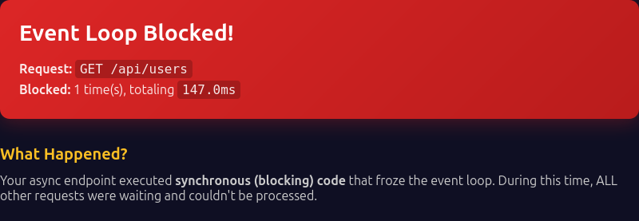

<p align="center">
  
</p>

<p align="center">
  <strong>Catch event-loop blocking in FastAPI with per-request attribution.</strong>
</p>

---

[](https://badge.fury.io/py/fastapi-loopguard)
[](https://www.python.org/downloads/)
[](https://opensource.org/licenses/MIT)

When a request blocks your event loop (via `time.sleep()`, blocking I/O, or CPU work), LoopGuard detects it **and tells you which endpoint caused it**.

## Install

```bash
pip install fastapi-loopguard
```

## Quick Start

```python
from fastapi import FastAPI
from fastapi_loopguard import LoopGuardMiddleware

app = FastAPI()
app.add_middleware(LoopGuardMiddleware)
```

Done. You now detect and enforce against blocking.

## Enforcement Modes

Choose how to respond to blocking:

| Mode | Behavior | Use Case |
|------|----------|----------|
| `"log"` | Silent logging | Production |
| `"warn"` | Console warnings + headers | Development (default) |
| `"strict"` | HTTP 503 + error page | Learning / CI |

```python
from fastapi_loopguard import LoopGuardConfig

# Dev: Show blocking immediately
config = LoopGuardConfig(dev_mode=True)

# Prod: Log silently, don't block responses
config = LoopGuardConfig(enforcement_mode="log")

app.add_middleware(LoopGuardMiddleware, config=config)
```

## What You Get

**Strict mode** returns an educational 503 page:



**Dev mode** adds headers to every response:

```
X-Request-Id: abc-123
X-Blocking-Count: 1
X-Blocking-Duration-Ms: 147
```

**Log mode** writes structured logs with request attribution.

---

**Want more?** See [ARCHITECTURE.md](docs/ARCHITECTURE.md) for internals, config details, and advanced features like adaptive thresholds.
