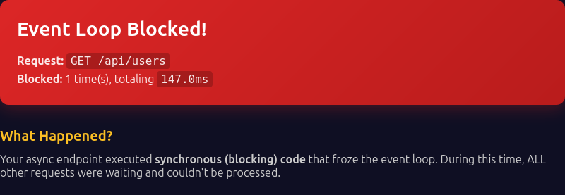
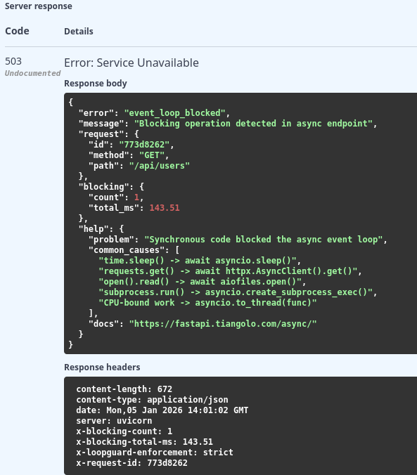
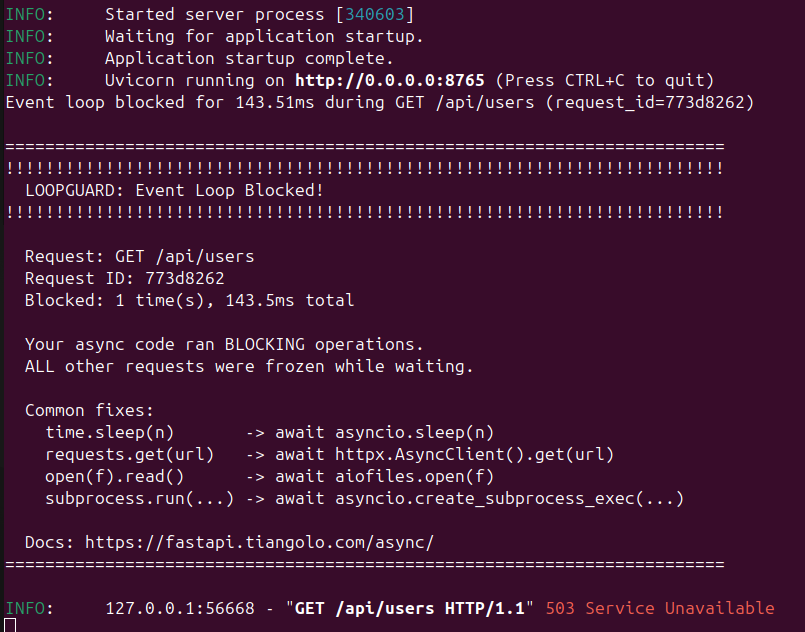

<p align="center">
  
</p>

<p align="center">
  <strong>Catch event-loop blocking in FastAPI and see which requests were in flight.</strong>
</p>

<p align="center">
  <a href="https://badge.fury.io/py/fastapi-loopguard"></a>
  <a href="https://www.python.org/downloads/"></a>
  <a href="https://opensource.org/licenses/MIT"></a>
</p>

---

When something blocks your event loop (via `time.sleep()`, blocking I/O, or CPU work), LoopGuard detects it **and narrows it down to the requests that were in flight when the loop stalled**. The sentinel measures loop lag, so it cannot name the single guilty handler — it reports every request that was active during the stall.

## Install

```bash
pip install fastapi-loopguard
```

## Quick Start

```python
from fastapi import FastAPI
from fastapi_loopguard import LoopGuardMiddleware

app = FastAPI()
app.add_middleware(LoopGuardMiddleware)
```

## Enforcement Modes

| Mode | Behavior | Use Case |
|------|----------|----------|
| `"warn"` | Console warnings + headers | **Default** |
| `"strict"` | HTTP 503 + error page | Development / CI |
| `"log"` | Silent logging | Production |

```python
from fastapi_loopguard import LoopGuardConfig

# Development: diagnostic headers on every response
config = LoopGuardConfig(dev_mode=True)

# Development / CI: fail loudly with an educational 503
config = LoopGuardConfig(enforcement_mode="strict")

# Production: silent logging
config = LoopGuardConfig(enforcement_mode="log")

app.add_middleware(LoopGuardMiddleware, config=config)
```

## What You Get

### Strict Mode
Returns an educational 503 page that explains what went wrong and how to fix it:

<p align="center">
  
</p>

---

### Warn Mode
Adds diagnostic headers to every response for debugging:

<p align="center">
  
</p>

---

### Log Mode
Writes structured logs listing the requests that were in flight:

<p align="center">
  
</p>

---

<p align="center">
  <a href="docs/CONFIGURATION.md"><strong>Full Configuration Reference</strong></a>
</p>
